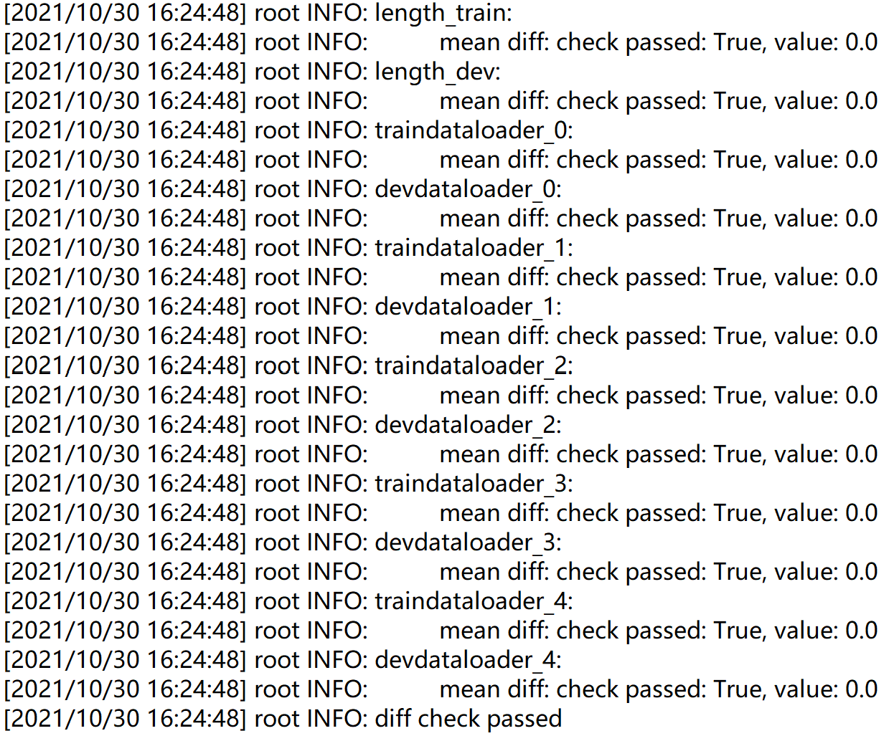
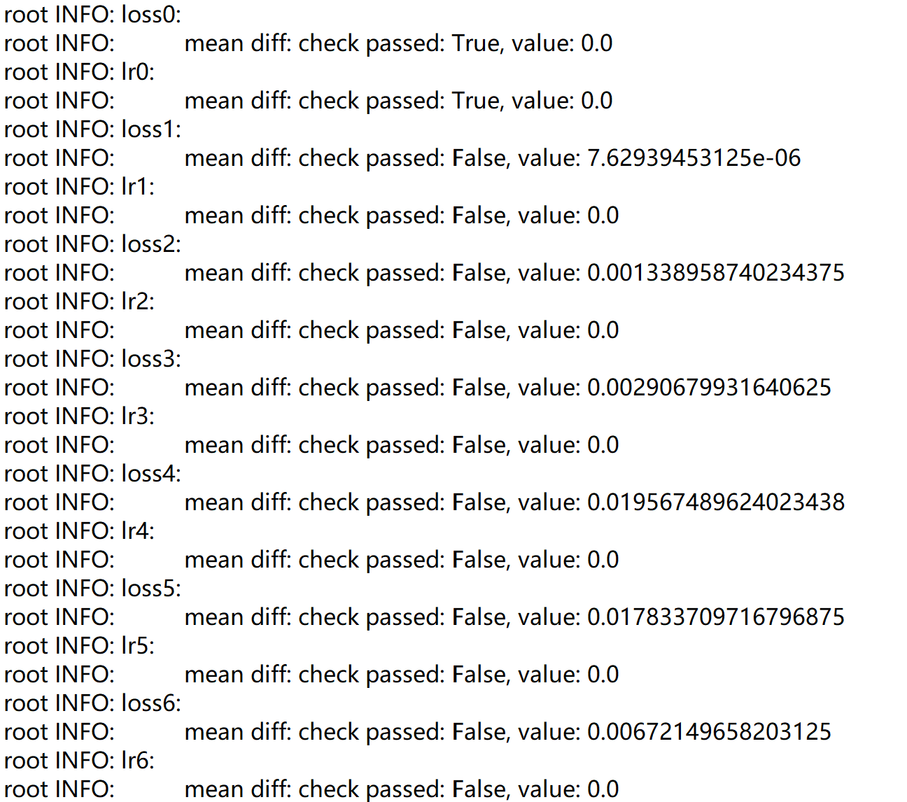

# QANET_paddle

[English](./README.md) | 简体中文

 * [QANET_paddle](#QANET_paddle)
     * [一、简介](#一、简介)
     * [二、复现精度+对齐](#二、复现精度+对齐)
     	* [step1: 模型结构对齐](#step1: 模型结构对齐)
        * [step2: 验证/测试集数据读取对齐](#step2: 验证/测试集数据读取对齐)
        * [step3: 评估指标对齐](#step3: 评估指标对齐)
        * [step4: 损失函数对齐](#step4: 损失函数对齐)
        * [step5: 反向对齐](#step5: 反向对齐)
     * [三、数据集](#三、数据集)
     * [四、环境依赖](#四、环境依赖)
     * [五、快速开始](#五、快速开始)
        * [step1: clone](#step1: clone )
        * [step2: 数据准备](#step2: 数据准备)
        * [step3: 训练](#step3: 训练)
     * [六、代码结构与详细说明](#六、代码结构与详细说明)
        * [6.1 代码结构](#6.1 代码结构)
        * [6.2 参数说明](#6.2 参数说明)
        * [6.3 训练流程](#6.3 训练流程)
     * [七、模型信息](#七、模型信息)


## 一、简介

本项目基于paddlepaddle_v2.2.0rc0框架复现QANET(ICLR 2018)[链接 ](https://arxiv.org/abs/1804.09541)。

目前的端到端机器阅读和问答模型主要基于包含注意力的循环神经网络，抛开优点，这些模型的主要缺点是：在训练和推理方面效率较低。 因此作者提出了一种名为QANet的问答架构，这个网络不需要使用递归网络，它的编码器完全由卷积和self-attention组成，卷积网络处理局部信息，self-attention处理全局范围内的信息。

**论文:**

- [1] Yu, A. W. ,  D  Dohan,  Luong, M. T. ,  Zhao, R. ,  Chen, K. , &  Norouzi, M. , et al. (2018). Qanet: combining local convolution with global self-attention for reading comprehension.

**参考项目：**

- [BangLiu/QANet-PyTorch: Re-implement "QANet: Combining Local Convolution with Global Self-Attention for Reading Comprehension" (github.com)](https://github.com/BangLiu/QANet-PyTorch)

**项目aistudio地址：**

- notebook任务：

## 二、复现精度+对齐

该模型是在SQuAD1.1数据集上训练＋验证。

！！！指标and结果

对齐具体步骤可参考https://github.com/PaddlePaddle/models/blob/develop/docs/ThesisReproduction_CV.md

### step1: 模型结构对齐 

对齐模型结构时，一般有3个主要步骤：

- 网络结构代码转换
- 权重转换
- 模型组网正确性验证

对齐结果如下所示：


### step2: 验证/测试集数据读取对齐

对齐结果如下所示：



### step3: 评估指标对齐

对齐结果如下所示：


### step4: 损失函数对齐

### 

### step5: 反向对齐




## 三、数据集

[SQuAD1.1](https://datarepository.wolframcloud.com/resources/SQuAD-v1.1)

- 数据集大小：
  - 训练集：87.5K
  - 验证集：10.1K
- 数据格式：文本，JSON

## 四、环境依赖

- 硬件：CPU、GPU（建议使用16G及以上）
- 框架：
  - PaddlePaddle >= 2.2.0rc0
- 包：
  - spacy
  - ujson
## 五、快速开始

### step1: clone 

```bash
# clone this repo
git clone git@github.com:27182812/QANet_paddle.git
cd QANet_paddle
```
**安装依赖**
```bash
pip install -r requestments.txt
```

### step2: 数据准备

1. 在顶层目录下创建datasets/original文件夹，在次文件下将[glove.840B.300d.txt](https://www.kaggle.com/takuok/glove840b300dtxt)放入Glove文件夹，SQuAD数据集放入SQuAD文件夹下。如下图所示：
2. 初次运行时，加上`--processed_data`,会对数据进行预处理，处理后的数据放datasets/original/processed文件夹下。下次运行可直接加载。


### step3: 训练

1. 在顶层目录下放入预训练权重（初始化pytorch版权重转换为pdparams格式），地址为：https://aistudio.baidu.com/aistudio/datasetdetail/114636 。
2. 运行`QANet_main.py`

```bash
python QANet_main.py --batch_size 32 --epochs 60 --with_cuda --use_ema
```

## 六、代码结构与详细说明

### 6.1 代码结构

```
├─data_loader                     # 数据加载
├─datasets                        # 数据集
├─imgs                            # 说明图片
├─log_reprod                      # 对齐文件
├─model                           # 模型
├─trainer                         # 训练
├─util                            # 工具函数
│  README.md                      # 英文readme
│  README_CN.md                   # 中文readme
│  requirements.txt               # 依赖
│  QANet_main.py                  # 运行文件
```
### 6.2 参数说明

可以在 `QANet_main.py` 中设置训练与评估相关参数，主要参数列举如下：

| 参数         | 默认值        | 说明                                   | 其他        |
| ------------ | ------------- | -------------------------------------- | ----------- |
| --batch_size | 32,      可选 | 训练批次                               |             |
| --epochs     | 30，   可选   | 训练轮次                               |             |
| --with_cuda  | False, 可选   | 是否使用GPU                            | 无GPU可不加 |
| --use_ema    | False, 可选   | whether use exponential moving average |             |
| --lr         | 0.001,可选    | 学习率                                 |             |

### 6.3 训练流程

详见 五、快速开始

## 七、模型信息

关于模型的其他信息，可以参考下表：

| 信息     | 说明                                                         |
| -------- | ------------------------------------------------------------ |
| 发布者   | 钱宇珊                                                       |
| 时间     | 2021.10                                                      |
| 框架版本 | Paddle 2.2.0rc0                                              |
| 应用场景 | 自然语言处理、阅读理解                                       |
| 支持硬件 | GPU、CPU                                                     |
| 下载链接 | [训练好的模型]()                                             |
| 在线运行 | [notebook](https://aistudio.baidu.com/aistudio/projectdetail/2542813) |

